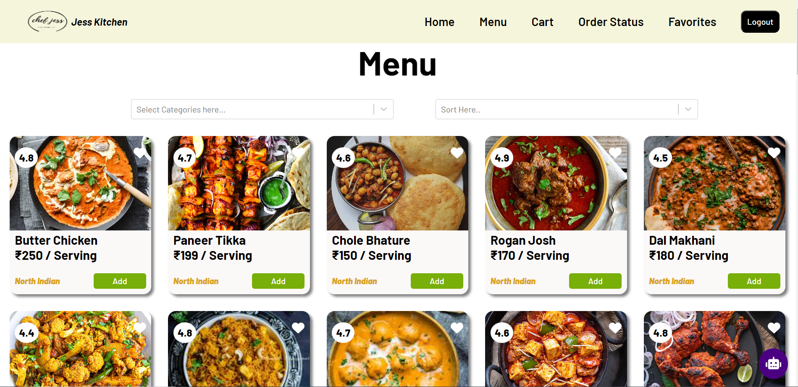

# Food Delivery App
[Hosted Link](https://food-delivery-react-jessk.vercel.app/)

A food delivery app built using React offers a dynamic and user-friendly interface for ordering food from a restaurant. Leveraging React's component-based architecture, this app provides interactive features like real-time menu browsing, secure payment processing, and order tracking. React's efficiency ensures smooth performance across different devices, enhancing the overall user experience.

### Features
- Real-time Menu Browsing: Explore various dishes from multiple restaurants with up-to-date information.
- Secure Payment Processing: Ensure safe and reliable transactions for all your orders.
- Order Tracking: Track your order status from preparation to delivery.
- Favorites: Save your favorite dishes for quick access.
- Cart Management: Easily add, remove, and manage items in your cart.
- User Authentication: Allows users to sign up, log in, and log out securely using Firebase Authentication.
- Email Verification: Sends a verification email to new users to confirm their email address.
- Password Reset: Provides users with the option to reset their password if they forget it.
- Error Handling: Displays relevant error messages for failed login or registration attempts.
- Responsive Design: Enjoy a seamless experience across all devices, including desktops, tablets, and smartphones.

### Components
The app is built with a variety of components to ensure a modular and maintainable codebase. Some key components include:

- Login / SignUp: This component uses Firebase for secure authentication, allowing users to sign up and log in, ensuring only authenticated users can access certain app features, enhancing security and user experience.
- Menu: Displays the list of available dishes with options to filter and sort.
- Cart: Manages the items added to the cart.
- Favorites: Lists the user's favorite dishes.
- OrderStatus: Shows the status of the current order.
- Navbar: Provides navigation links to different sections of the app.
- Chatbot: Offers customer support and assistance.
- Footer: Contains additional links and information.

## Hosted Link

You can access a live demo of the project [here](https://food-delivery-react-jessk.vercel.app/).
